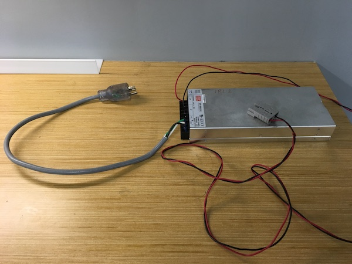
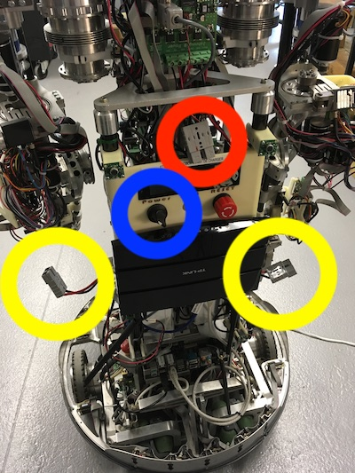
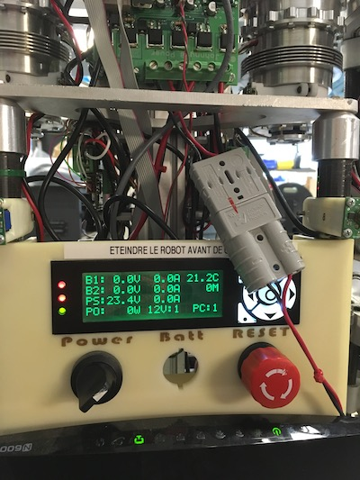
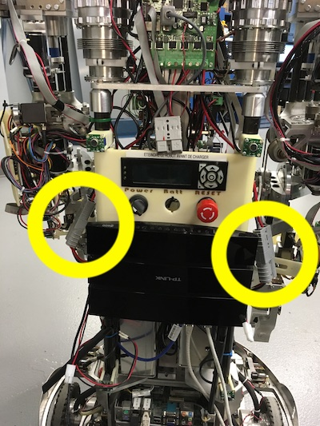
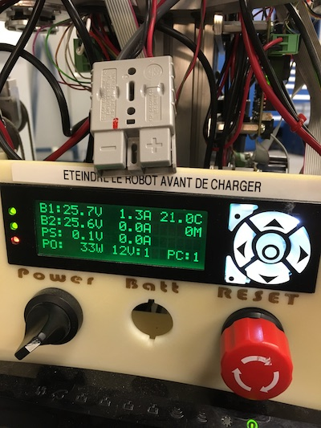
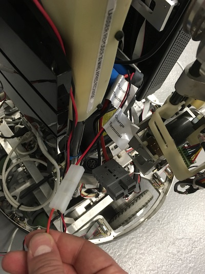
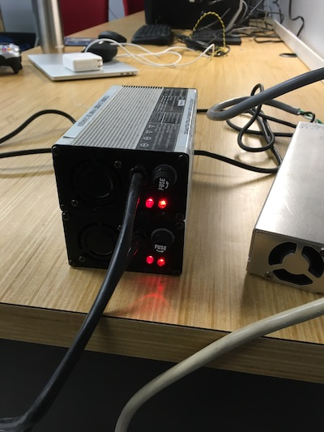
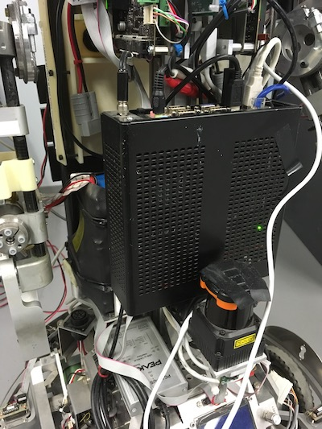
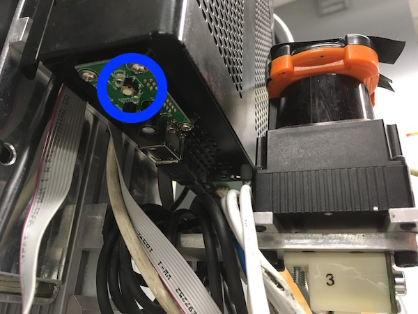

# IRL-1


## Introduction

IRL-1 is wheeled, humanoid robot built at Université de Sherbrooke's IntRoLab.
It is a combination of two fully independent robots:

 - Johnny-0, the humanoid torso with compliant arms and an expressive head;
 - A choice of two mobile bases, AZIMUT-3 (omnidirectional and compliant) or Telerobot (differential drive)

The software is entirely based on ROS with custom packages found in this repository.
The aim of this guide is to describe how to use the robot, from startup to the development of higher-level capabilities.

**This is a living document and is not meant to be fully complete from the beginning.
Feel free to suggest improvements or guides of your own.**

## Startup

Since IRL-1 is two independent robots, they both have to be started separately. 
The order is not important, except if you require the network switch installed on the back of Johnny-0, as
it is powered by the torso.

### Johnny-0

Starting Johnny-0, while relatively easy, is a multistep process on the source of power.

#### Choosing the power source
Depending on the work you plan to do, the power source you will use is important.
Both power sources, the external one and the batteries, cannot be used at the same time.
Furthermore, they cannot be switched seamlessly.
Indeed, **Johnny-0, including the computer, has to be fully powered off before switching power sources**.

For development and light payloads on a single arm, the external power source can provide enough current.
Otherwise, the batteries are necessary.
While not dangereous by itself, a insufficient current delivery shuts down the whole Johnny-0 torso, which
means the computer will turn off and the arms might fall and collide with the rest of the robot or the environnement.

#### Using the external power source



1. **Power up the source itself.** The power source does not have a on/off switch, and always provide 24V when 
 
2. Connect the external power cable to the external power terminal, located in the middle of the torso. **Do not plug the external power source in one of the battery terminals! The following image shows the Johnny-0 connectors. The external power terminal is circled in red, the battery terminals in yellow, and the power switch in blue.



3. Turn on the torso power switch. The display should show 24V or so, as in the following picture.



#### Using the batteries

1. First, **make sure the robot is powered off, and the batteries are not connected to their chargers!**

2. Connect both batteries to their terminals, as in this picture (notice that the external power source and chargers are not connected):



3. Turn on the torso power switch. The display should show more than 24V on each battery, as in this picture:



#### Charging the batteries

When the batteries fall under approximately 23 V, it is time to charge them.
Failing to do so might not damage the batteries, as they will turn themselves off automatically, but will completely shut down the robot.

Each battery has a LiFePO4 charger with its own charging connector.
Charging can be done safely when the robot is used on the external power source.
**Again, switching power sources first require a complete shutdown of the Johnny-0 torso !**
Note that charging the batteries can be done without turning on the power management of the torso.

1. **Disconnected the batteries from the torso.** You have to make sure that the batteries are not currently powering the robot before charging them. Turning the robot off is not enough, **you need to disconnect each battery**.

3. Connect the chargers to an AC source. As with the external power supply, they do not have their own power switches.

4. Connect the batteries to their chargers, as in the following picture:



5. Turn on the chargers. Both LEDs should turn red:



When both batteries are full, the second LED on each charger should turn green.
**Remember to let the batteries unconnected for at least 30 minutes after charging.**
This is part of the cell auto-balance procedure.

#### Turning on the computer

Once power is applied to the Johnny-0 torso, you can turn its computer on.



The power microswitch is located below the Mini-ITX case, circled here in blue:



Once powered on, you should see blue LEDs flashing near the microswitch, and see the CPU fan starting to turn through
the air vents of the case.


### Power Troubleshooting

**The LEDs on the Johnny-0 battery chargers do not behave normally.**
Try unplugging them, letting them rest for 30 seconds, and replugging everything.
The chargers are sometimes sensitive to the order in which they have been connected.
For instance, letting them plugged in the batteries for too long before plugging them in an AC power source seems to turned their detection circuitry off.
Letting them unplugged seems to reset this.

**The LEDs on the Johnny-0 battery chargers do not turn on at all.**
Each charger has two fuses: one external and one internal.
Check both fuses, as they tend to burn out easily.

## Shutdown

To shutdown the robot, you simply need to revert all the steps you took to power on the robot.
The PCs have to be shut down first, then the power management of each robot (power switch on the torso, power key on the mobile base).
Finally, you can disconnect the power sources from the robot.

## Accessing the computers through the network

A network switch and router is installed on the back of the Johnny-0 torso.
This router also connects to the 3IT wifi network and has access to the Internet.
The robot computers only have access through NAT, and are not exposed through the firewall.

To connect to any of the two computers on IRL-1, simply connect your computer to one of the free Ethernet ports on that switch.
The DHCP server will give you an address in the 192.168.3.* range, and you will be able to reach Johnny-0's computer through
SSH at **192.168.3.10**.
Please contact François Ferland or Dominic Létourneau if you want to create an account on the robot.

To easily access the robot through ROS, follow these instructions:

1. Add an entry for 'johnny0' in your /etc/hosts file.
This will make sure your computer knows about the "johnny0" hostname.
The line should look like this:

```
192.168.3.10 	johnny0
```

2. Set your ROS_MASTER_URI environment variable.
This will indicate to ROS on your computer that the master server runs on Johnny 0's computer (assuming you already started it there). 
Here's how to do it:

```
$ export ROS_MASTER_URI=http://johnny0:11311/
```

This has to be done in each of your terminal, or you can add it to your .bashrc file.
Note that using the IP address instead of johnny0 will initially work if you have not changed your /etc/hosts file, but you will not be able to receive any data from the robot, except the list of topics and services (through rostopic list).
This is because topics are still advertised with the "johnny0" hostname, and not the IP.

3. Set your ROS hostname to your IP (optional).

If you need to send data or call services on the robot, you will need to configure the ROS_HOSTNAME environment variable:

```
$ export ROS_HOSTNAME=192.168.3.XXX
```

This has to be done before starting any nodes on your computer.
This is because your own hostname will not be known to the robot, and it won't be able to locate it on the network.
This is the reverse problem of not setting a 'johnny0' entry in your /etc/hosts file.


